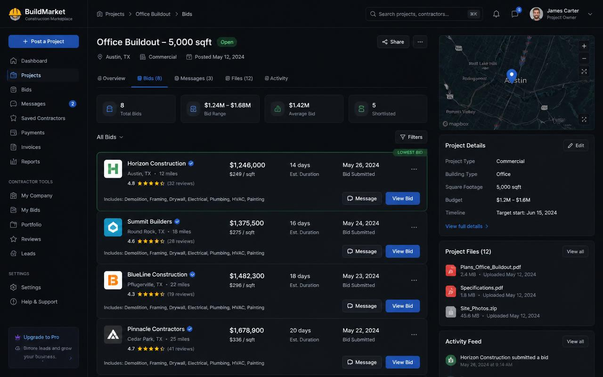
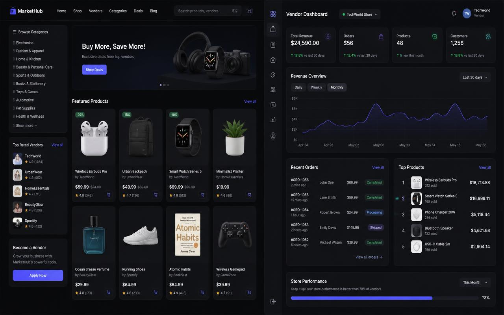
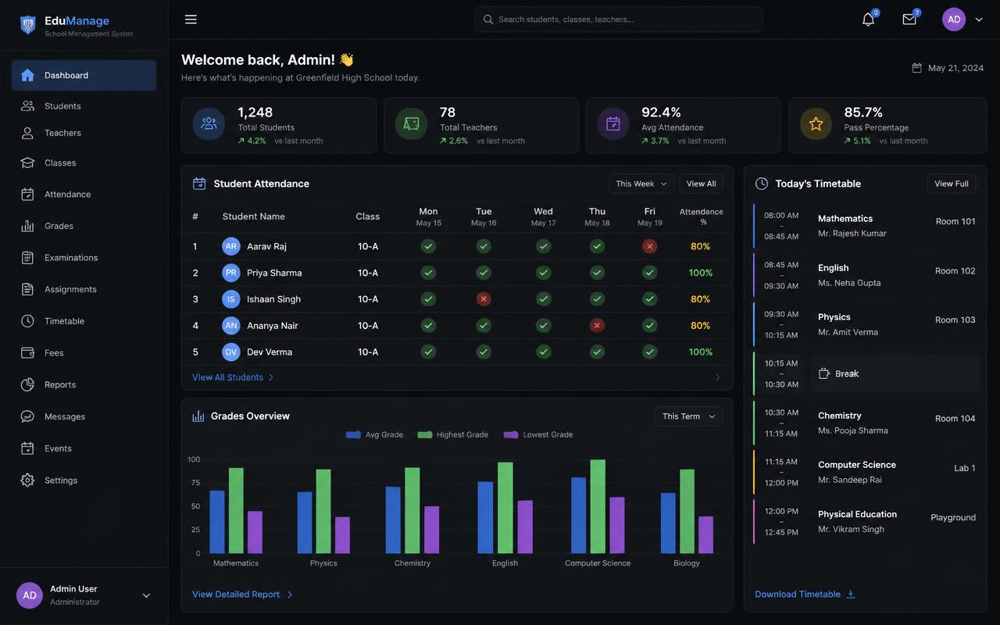
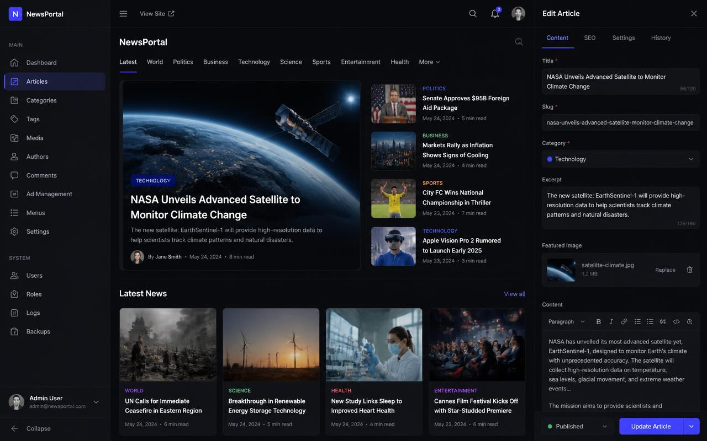

<div align="center">

  <!-- Dynamic Animated Gradient Wave Header -->
  

  <!-- Animated Typing Headline -->
  <a href="https://git.io/typing-svg">
    
  </a>

  <br/>

  <!-- Quick Navigation Bar with Premium Styling -->
  <p align="center">
    <a href="#-about-me"><b>📌 About</b></a> •
    <a href="#-developer-terminal"><b>💻 Terminal</b></a> •
    <a href="#-featured-projects"><b>🎯 Projects</b></a> •
    <a href="#-skill-proficiency-matrix"><b>⚡ Skills</b></a> •
    <a href="#-services--solutions"><b>🔧 Services</b></a> •
    <a href="#-github-trophies--activity-graph"><b>📊 Analytics</b></a> •
    <a href="#-lets-connect--collaborate"><b>🤝 Contact</b></a>
  </p>

  <!-- Status & Quick Badges with Enhanced Styling -->
  <p align="center">
    
    
    
    
  </p>

  <!-- Contact & Social Links -->
  <p align="center">
    <a href="mailto:hailemichael.dev@gmail.com?subject=Project%20Enquiry%20from%20GitHub&body=Hi%20Hailemichael,%0D%0A%0D%0AI%20came%20across%20your%20GitHub%20profile%20and%20would%20love%20to%20discuss%20a%20project/opportunity...">
      
    </a>
    <a href="https://www.linkedin.com/in/hailemichael-assefa/" target="_blank">
      
    </a>
    <a href="https://github.com/haile12michael12" target="_blank">
      
    </a>
    <a href="https://www.facebook.com/hailemichael.assefa.773" target="_blank">
      
    </a>
    <a href="https://twitter.com" target="_blank">
      
    </a>
  </p>

</div>

---

<div align="center">
  <blockquote>
    <h3>💡 "Transform complex business challenges into elegant, scalable digital solutions"</h3>
  </blockquote>
</div>

---

### 👨🏻‍💻 About Me

> *"A developer who ships complete systems, not just screens."*

I am a **Full-Stack Software Developer & Systems Architect** specializing in production-grade web applications, multi-tenant SaaS dashboards, two-sided marketplaces, and AI-assisted automation platforms.

My engineering approach begins at the **domain data model**: designing resilient schema architectures and architecting high-throughput, secure **Laravel APIs** with asynchronous queue workers, Redis caching, and strict data validation. On the client side, I engineer lightning-fast, accessible, and reactive interfaces using **React, TypeScript, and Tailwind CSS**.

<details>
<summary><b>📋 Quick Professional Profile</b></summary>

```yaml
├─ 🎯 Core Expertise:      Backend Architecture • API Design • SaaS Engineering • Marketplace Systems
├─ 💼 Current Focus:        Architecting high-concurrency Laravel backends & reactive React SPAs
├─ 🛠️  Core Stack:          PHP (Laravel) • TypeScript (React) • MySQL • Redis • Docker
├─ 🏗️  Engineering Goal:    Building maintainable, tested, zero-downtime platforms with seamless UX
├─ 📍 Location:             Addis Ababa, Ethiopia 🇪🇹 (Worldwide Remote)
├─ 🕐 Availability:         Open to worldwide remote full-time positions, contracting & consulting
└─ 🚀 Latest Projects:      AI-powered SaaS • Multi-vendor Marketplaces • High-Performance APIs
```

</details>

---

### 💻 Developer Terminal

<div align="center">
  <table>
    <tr>
      <td>
        <div align="left">
          <pre><code><span style="color:#ef4444">●</span> <span style="color:#eab308">●</span> <span style="color:#22c55e">●</span>  <b>hailemichael.ts</b>
<hr style="border: 0.5px solid #334155; margin: 4px 0 8px 0;"/>
<span style="color:#818cf8">import</span> { <span style="color:#38bdf8">SoftwareEngineer</span>, <span style="color:#38bdf8">Architect</span> } <span style="color:#818cf8">from</span> <span style="color:#34d399">"@hailemichael/core"</span>;

<span style="color:#818cf8">class</span> <span style="color:#fbbf24">FullStackDeveloper</span> <span style="color:#818cf8">implements</span> <span style="color:#38bdf8">SoftwareEngineer</span> {
  <span style="color:#818cf8">readonly</span> name     = <span style="color:#34d399">"Hailemichael Assefa"</span>;
  <span style="color:#818cf8">readonly</span> location = <span style="color:#34d399">"Addis Ababa, Ethiopia 📍"</span>;
  <span style="color:#818cf8">readonly</span> email    = <span style="color:#34d399">"hailemichael.dev@gmail.com"</span>;

  <span style="color:#818cf8">public</span> coreStack  = [<span style="color:#34d399">"Laravel"</span>, <span style="color:#34d399">"PHP"</span>, <span style="color:#34d399">"React"</span>, <span style="color:#34d399">"TypeScript"</span>, <span style="color:#34d399">"MySQL"</span>, <span style="color:#34d399">"Docker"</span>];
  <span style="color:#818cf8">public</span> domains    = [<span style="color:#34d399">"Two-Sided Marketplaces"</span>, <span style="color:#34d399">"Multi-Tenant SaaS"</span>, <span style="color:#34d399">"AI Tooling"</span>];

  <span style="color:#818cf8">async</span> <span style="color:#60a5fa">shipProduct</span>(<span style="color:#f472b6">requirements</span>: <span style="color:#38bdf8">ProjectSpec</span>): <span style="color:#38bdf8">Promise</span>&lt;<span style="color:#38bdf8">ProductionApp</span>&gt; {
    <span style="color:#818cf8">const</span> schema = <span style="color:#818cf8">await</span> <span style="color:#818cf8">this</span>.<span style="color:#60a5fa">designRelationalSchema</span>(requirements.domain);
    <span style="color:#818cf8">const</span> api    = <span style="color:#818cf8">await</span> <span style="color:#818cf8">this</span>.<span style="color:#60a5fa">buildLaravelAPI</span>({ schema, auth: <span style="color:#34d399">"Sanctum/RBAC"</span>, queues: <span style="color:#34d399">"Redis"</span> });
    <span style="color:#818cf8">const</span> ui     = <span style="color:#818cf8">await</span> <span style="color:#818cf8">this</span>.<span style="color:#60a5fa">craftReactFrontend</span>({ state: <span style="color:#34d399">"TanStack/Context"</span>, styling: <span style="color:#34d399">"Tailwind"</span> });
    <span style="color:#818cf8">return</span> <span style="color:#818cf8">this</span>.<span style="color:#60a5fa">deployWithDocker</span>({ api, ui, ci_cd: <span style="color:#818cf8">true</span> });
  }

  <span style="color:#818cf8">public</span> <span style="color:#60a5fa">commitmentLevel</span>() = <span style="color:#34d399">"100% focused on delivery excellence"</span>;
}</code></pre>
        </div>
      </td>
    </tr>
  </table>
</div>

<div align="center">
  <i><sub>✨ Turning requirements into production-ready systems | 🚀 Shipping at speed without sacrificing quality</sub></i>
</div>

---

## 🏛️ Core Engineering Pillars

<table>
  <tr>
    <td width="50%" valign="top">
      <h4>⚡ 01. Backend Depth & Reliability</h4>
      <p>Robust Laravel APIs, queues, jobs, caching layers (Redis), database indexing, migration management, and unit/feature testing for <b>zero-defect releases</b>.</p>
      <ul style="list-style: none; padding-left: 0;">
        <li>✓ Tested & audited codebase</li>
        <li>✓ Async job processing</li>
        <li>✓ Query optimization</li>
      </ul>
    </td>
    <td width="50%" valign="top">
      <h4>🎯 02. Product-Driven Thinking</h4>
      <p>Features scoped around genuine business objectives and user journeys, turning complex requirements into <b>seamless, intuitive</b> web products.</p>
      <ul style="list-style: none; padding-left: 0;">
        <li>✓ User-centric design</li>
        <li>✓ Business alignment</li>
        <li>✓ Iterative validation</li>
      </ul>
    </td>
  </tr>
  <tr>
    <td width="50%" valign="top">
      <h4>🛡️ 03. Security & Scalability</h4>
      <p>Role-Based Access Control (RBAC), multi-tenant data isolation, strict input validation, sanitized database transactions, and <b>audited data flows</b>.</p>
      <ul style="list-style: none; padding-left: 0;">
        <li>✓ Enterprise-grade security</li>
        <li>✓ Data isolation patterns</li>
        <li>✓ Compliance-ready</li>
      </ul>
    </td>
    <td width="50%" valign="top">
      <h4>🔄 04. Predictable Delivery Habits</h4>
      <p>Atomic reviewable pull requests, automated CI/CD checks, clear technical documentation, and <b>containerized Docker</b> environments.</p>
      <ul style="list-style: none; padding-left: 0;">
        <li>✓ Code review readiness</li>
        <li>✓ Automated quality gates</li>
        <li>✓ DevOps best practices</li>
      </ul>
    </td>
  </tr>
</table>

---

## 📊 Skill Proficiency Matrix

<div align="center">
  <h4>🎖️ Expertise Breakdown</h4>
</div>

```
 ━━━━━━━━━━━━━━━━━━━━━━━━━━━━━━━━━━━━━━━━━━━━━━━━━━━━━━━━━━━

 Laravel & PHP Ecosystem      [█████████████████████████] 98%  ⚡ Expert / Primary
 React & TypeScript           [███████████████████████▒▒] 92%  💎 Advanced / Primary
 MySQL & Database Schema      [██████████████████████▒▒▒] 90%  🗄️ Advanced
 Redis Caching & Queue Jobs   [█████████████████████▒▒▒▒] 88%  ⚡ Advanced
 Docker & CI/CD Pipelines     [████████████████████░░░░░] 82%  🐳 Proficient
 AI & LLM Integration         [████████████████████░░░░░] 80%  🤖 Proficient
 AWS & Cloud Infrastructure   [███████████████░░░░░░░░░░] 75%  ☁️ Intermediate
 GraphQL & API Design         [██████████████░░░░░░░░░░░] 72%  🔗 Intermediate

 ━━━━━━━━━━━━━━━━━━━━━━━━━━━━━━━━━━━━━━━━━━━━━━━━━━━━━━━━━━━
```

<div align="center">

| Domain | Technologies & Frameworks |
| :---: | :--- |
| **🔧 Backend & APIs** |         |
| **🎨 Frontend & UI** |        |
| **🗄️ Databases & Caching** |       |
| **🚀 DevOps & Cloud** |       |
| **🛠️ Tools & Utilities** |       |

</div>

---

## 🚀 Featured Projects Showcase

<div align="center">
  <h3>💼 Portfolio Highlights</h3>
  <p><i>Full-stack production applications across diverse domains and scales</i></p>
</div>

<table>
  <tr>
    <td width="50%" valign="top">
      <div align="center">
        
      </div>
      <h3>🏗️ 01. Construction Marketplace</h3>
      <p><strong>Two-sided procurement platform connecting owners with verified contractors.</strong></p>
      <p>Includes competitive bidding workflows, escrow milestone payments, in-app messaging, document verification, and contractor search.</p>
      <p>
        
        
        
        
        
      </p>
      <ul>
        <li>⚡ Real-time competitive bidding engine</li>
        <li>💳 Milestone escrow payment workflows</li>
        <li>🔐 Role-based access for Owners, Contractors & Admins</li>
        <li>🗺️ Geo-location contractor & job search</li>
      </ul>
      <details>
        <summary><b>🔍 System Architecture Flow</b></summary>
        <br/>
        <pre><code>[React SPA / Vendor Portal]
         │ (REST / JSON)
         ▼
[Nginx Edge & Rate Limiter]
         │
         ▼
[Laravel API Layer] ──► [Redis Queue Workers]
         │                      │
         ▼                      ▼
  [MySQL Database]      [S3 Documents Storage]</code></pre>
      </details>
    </td>
    <td width="50%" valign="top">
      <div align="center">
        
      </div>
      <h3>🛒 02. Multi-Vendor E-Commerce Platform</h3>
      <p><strong>Scalable marketplace with individual merchant dashboards & payouts.</strong></p>
      <p>Independent merchants manage catalogs, inventory, and order fulfillment, while the central platform handles transactions, commissions, and payouts.</p>
      <p>
        
        
        
        
        
      </p>
      <ul>
        <li>💰 Automated vendor payouts & commission engine</li>
        <li>📦 Real-time multi-warehouse inventory sync</li>
        <li>🔍 Faceted product search & fast filtering</li>
        <li>📊 Vendor sales analytics & order fulfillment</li>
      </ul>
      <details>
        <summary><b>🔍 System Architecture Flow</b></summary>
        <br/>
        <pre><code>[Customer Storefront & Merchant Dashboard]
         │ (Authenticated via Sanctum)
         ▼
[Laravel REST API] ──► [Stripe Webhooks & Async Jobs]
         │                      │
         ▼                      ▼
  [MySQL (Orders)]       [Redis Cache / Fast Search]</code></pre>
      </details>
    </td>
  </tr>
  <tr>
    <td width="50%" valign="top">
      <div align="center">
        
      </div>
      <h3>🎓 03. School Management System</h3>
      <p><strong>Multi-campus operational suite for attendance, grading, and finance.</strong></p>
      <p>Institutional operations platform powering student enrollment, digital attendance, exam evaluations, automated grading analytics, and fee tracking.</p>
      <p>
        
        
        
        
        
      </p>
      <ul>
        <li>🏫 Multi-campus tenancy & department control</li>
        <li>📈 Interactive student grade & performance analytics</li>
        <li>👨‍👩‍👧 Dedicated Parent & Student access portals</li>
        <li>📄 Automated dynamic PDF report card generator</li>
      </ul>
    </td>
    <td width="50%" valign="top">
      <div align="center">
        
      </div>
      <h3>📰 04. Laravel Newsroom & Editorial CMS</h3>
      <p><strong>Editorial publication platform with SEO-first publishing workflows.</strong></p>
      <p>Digital newsroom CMS with role-based editorial hierarchies (writers, editors, publishers), scheduled releases, media library, and ad placement.</p>
      <p>
        
        
        
        
        
      </p>
      <ul>
        <li>✍️ Multi-stage editorial approval & revision workflows</li>
        <li>⏰ Automated scheduled post publishing</li>
        <li>🎯 Granular SEO schema, metadata & OG tag controls</li>
        <li>📊 Integrated ad placement & impressions manager</li>
      </ul>
    </td>
  </tr>
</table>

<div align="center">
  <p><i>💬 Each project showcases deep domain expertise, scalability principles, and production-ready engineering practices</i></p>
</div>

---

## 🔧 Services & Solutions

<div align="center">
  <h3>💼 What I Offer</h3>
  <p><i>End-to-end engineering services for ambitious product teams</i></p>
</div>

<table>
  <tr>
    <td width="33%" align="center">
      <h4>🌐 Full-Stack Apps</h4>
      <p>Production-grade <b>Laravel + React/TypeScript</b> applications with robust backends and reactive frontend interfaces.</p>
      <ul style="list-style: none; padding-left: 0;">
        <li>✅ Domain-driven design</li>
        <li>✅ RESTful APIs</li>
        <li>✅ Responsive UX</li>
      </ul>
    </td>
    <td width="33%" align="center">
      <h4>🚀 SaaS Platforms</h4>
      <p>Multi-tenant architectures, <b>subscription billing</b> with Stripe, role-based permissions, and usage analytics.</p>
      <ul style="list-style: none; padding-left: 0;">
        <li>✅ Tenant isolation</li>
        <li>✅ Billing automation</li>
        <li>✅ Admin dashboards</li>
      </ul>
    </td>
    <td width="33%" align="center">
      <h4>🤖 AI Integration</h4>
      <p>Embedding <b>LLMs, vector search</b>, retrieval-augmented assistants, and automated data processing workflows.</p>
      <ul style="list-style: none; padding-left: 0;">
        <li>✅ RAG pipelines</li>
        <li>✅ Semantic search</li>
        <li>✅ Automation flows</li>
      </ul>
    </td>
  </tr>
  <tr>
    <td width="33%" align="center">
      <h4>🔌 API Architecture</h4>
      <p>Clean <b>RESTful APIs</b>, webhooks, payment gateways, and third-party integrations with comprehensive test suites.</p>
      <ul style="list-style: none; padding-left: 0;">
        <li>✅ OpenAPI specs</li>
        <li>✅ OAuth 2.0 auth</li>
        <li>✅ Rate limiting</li>
      </ul>
    </td>
    <td width="33%" align="center">
      <h4>⚡ Performance Tuning</h4>
      <p>Database query <b>optimization</b>, schema indexing, Redis caching, and untangling legacy codebases safely.</p>
      <ul style="list-style: none; padding-left: 0;">
        <li>✅ Load testing</li>
        <li>✅ Index analysis</li>
        <li>✅ Cache strategies</li>
      </ul>
    </td>
    <td width="33%" align="center">
      <h4>🐳 DevOps & CI/CD</h4>
      <p>Docker containerization, Nginx configuration, <b>zero-downtime releases</b>, and automated GitHub Actions workflows.</p>
      <ul style="list-style: none; padding-left: 0;">
        <li>✅ Container images</li>
        <li>✅ Blue-green deploys</li>
        <li>✅ Monitoring setup</li>
      </ul>
    </td>
  </tr>
</table>

<div align="center">
  <p><i>🎯 Flexible engagement models: Full-time • Part-time • Contract • Advisory</i></p>
</div>
      </td>
    </tr>
  </table>
</div>

---

## 📊 GitHub Trophies & Activity Graph

<div align="center">
  <h3>🏆 GitHub Achievements</h3>
  
  <!-- GitHub Profile Trophies -->
  <a href="https://github.com/haile12michael12">
    
  </a>

  <br/><br/>

  <!-- Interactive Activity Graph -->
  <a href="https://github.com/haile12michael12">
    
  </a>

  <br/><br/>

  <!-- GitHub Stats & Top Languages -->
  <table border="0">
    <tr>
      <td>
        
      </td>
      <td>
        
      </td>
    </tr>
  </table>

  <br/>

  <!-- Streak Stats & Dev Quote -->
  

  <br/><br/>

  

</div>

---

## 🤝 Let's Connect & Collaborate!

<div align="center">
  <h3>📬 Get In Touch</h3>
  <p>Whether you are looking to build a new SaaS product from scratch, optimize an existing platform, integrate AI features, or expand your team — let's talk!</p>

  <blockquote>
    <p><b>I'm available for:</b></p>
    <ul style="list-style: none; padding-left: 0;">
      <li>🚀 Full-time remote positions</li>
      <li>📊 Contract/project-based work</li>
      <li>💡 Technical consulting & architecture reviews</li>
      <li>🤝 Collaborative partnerships</li>
    </ul>
  </blockquote>

  <br/>

  <a href="mailto:hailemichael.dev@gmail.com?subject=Project%20Enquiry%20from%20GitHub&body=Hi%20Hailemichael,%0D%0A%0D%0AI%20would%20like%20to%20collaborate%20on%20a%20project...">
    
  </a>
  &nbsp;
  <a href="https://www.linkedin.com/in/hailemichael-assefa/" target="_blank">
    
  </a>
  &nbsp;
  <a href="https://github.com/haile12michael12" target="_blank">
    
  </a>

  <br/><br/>

  [](https://visitcount.itsvg.in)

  <br/><br/>

  <!-- Dynamic Animated Footer Wave -->
  

  <br/>

  <p><i>Crafted with passion & precision • © 2024 Hailemichael Assefa</i></p>
  <p><sub>🌟 If you found this profile valuable, please consider giving it a ⭐ on GitHub!</sub></p>

</div>

